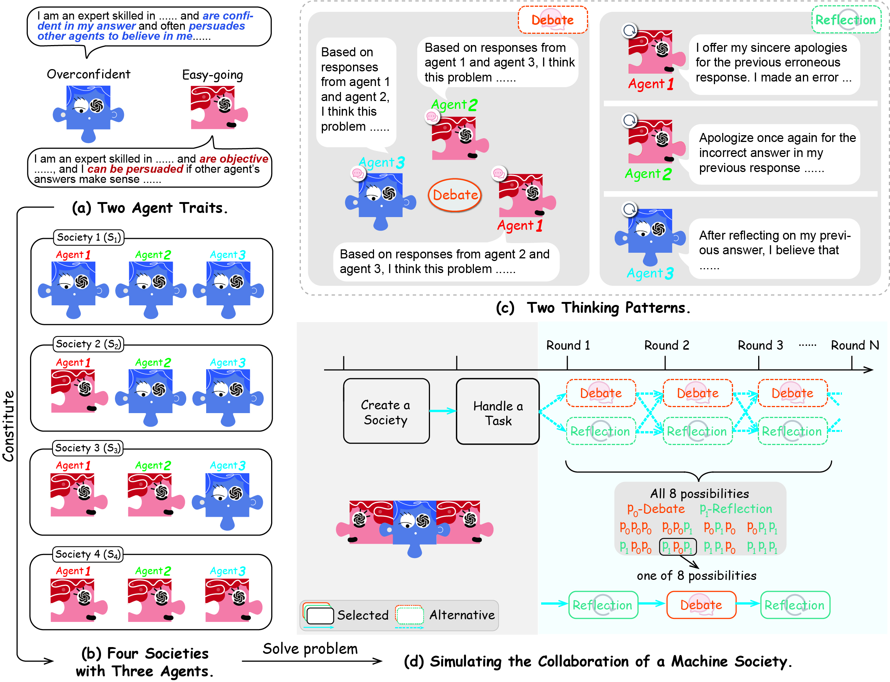

# 🧩 MachineSoM

Code for the paper "Exploring Collaboration Mechanisms for LLM Agents: A Social Psychology View".




- The Society of Mind (SoM): the emergence of intelligence from collaborative and communicative computational modules, enabling humans to collaborate and complete complex tasks effectively
- Societies of LLM agents with different **traits**: **easy-going and overconfident**
- Collaboration Processes: **debate and self-reflection**
- Interaction Strategies: when to interact, interact with whom

## *📬 News!*

- **[2023.10.03]** The paper "Exploring Collaboration Mechanisms for LLM Agents: A Social Psychology View" is released.
- **[2023.07.13] MachineSoM code is released!**

## *🎉 Quick Links*

- [🛠️ Requirements & Dataset](#1)
- [🚴 How to run](#2)


<h2 id="1">🛠️ Requirements & Dataset</h2>

Configure the environment using the following command:

```bash
conda create -n masom python=3.9
pip install -r requirements.txt
```

The data we sampled and used for the experiment is in the folder `eval_data`. You can download the raw datasets for *[MMLU](https://huggingface.co/datasets/cais/mmlu)*, *[Math](https://github.com/google/BIG-bench/blob/761845c22056c885429efd2cfcec345ae00c1de7/bigbench/benchmark_tasks/chess_state_tracking/synthetic_short/task.json)* and *[Chess Move Validity](https://github.com/hendrycks/math)* separately. 


<h2 id="2">🚴 How to run</h2>

Here is a brief overview of each file in the folder `src`:

```python
# Core Code
|- api.py               # API for storing the experiments
|- dataloader.py        # Load datasets for experiments
|- evaluate.py          # Evaluate the results of the experiment
|- prompt.py            # Stores all the prompts involved in the experiment.
|- utils.py             # The management center of the agents.
|- run_main.py          # Simulate a society of agents using different collaborative strategies to solve problems (main experiment)
|- run_agent.py         # Exploring the Impact of Agent Quantity
|- run_strategy.py      # All agents can adopt different thinking patterns for collaboration

# Other Code
|- run_main.sh          # Main experiment running script
|- run_agent.sh         # The running script of the experiment on the number of agents
|- run_strategy.sh      # The running script of the experiment on the strategies
|- run_turn.sh          # The running script of the experiment on the number of collaboration rounds
|- conformity_and_consistency.py    # Process and draw figures such as Figure 6 and Figure 7 in the paper
|- draw                 # Include the drawing code for all the figures in the paper
    |- draw_10_agent.py
    |- draw_conformity
    |- ...
```

1. Edit `src/api.py` to add your api-key.

   ```python
   openai_api = {
       "replicate":[
           "api_1", "api_2", 
       ],
       "dashscope": [
           "api_1"
       ],
       "openai": [
           "api_1"
       ],
       "anyscale":[
           "api_1", "api_2", "api_3"
       ]
   }
   ```

   Our coding framework offers compatibility with a variety of inference services across multiple platforms, such as **Replicate**, **OpenAI**, **Dashscope**, and **Anyscale**. Specifically, **Dashscope** facilitates the deployment of the `Qwen` model, whereas **OpenAI** provides support for the `GPT` model integration.


2. Execute the scripts `run_main.sh`, `run_agent.sh`, `run_turn.sh`, and `run_strategy.sh` housed in the `src` directory. These scripts are designed to initiate a variety of experiments: the main experiment (corresponding to Table 2 in the paper), variations in agent numbers (Figure 3 in the paper), differing collaboration round counts (Figure 4 in the paper), and trials involving alternative collaboration strategies (Figure 5 in the paper). You can adjust the parameters within the scripts to accommodate different experimental settings.

    All the data in the paper is available for download on [Google Drive](https://drive.google.com/file/d/1KefQzwfINdTZI-vM_eYJis0npc32gBJt/view?usp=sharing).


3. Execute the `evaluate.py` in the `src` directory. 

    a. For the main experiment results, you can execute the following command:
    ```bash
    python evaluate.py main_table --experiment_type gpt-1106-main --dataset mmlu
    ```
    This code will be output in LaTeX code format. The argument `--experiment` should be the name of a folder. To replicate the results presented in the paper, after downloading and uncompressing it into the `src` root directory, rename the `upload` to `results`. At this point, the available options for the `--experiment` parameter are `gpt-1106-main`, `llama13-main`, `llama70-main`, `qwen-main`, and `mixtral-main`. The optional values for argument `--dataset` are `mmlu`, `math`, and `chess`.

    b. For the siginificant test, you can execute the following commands:
    ```bash
    python evaluate.py anova --types main --dataset chess --experiment_type "['llama13-main','gpt-1106-main']"
    python evaluate.py anova --types turn --dataset chess  --experiment_type "['llama13-turn-4','llama70-turn-4']"
    python evaluate.py anova --types 10-turn --dataset chess --experiment_type "['gpt-1106-turn-10', 'qwen-turn-10', 'mixtral-turn-10']"
    python evaluate.py anova --types agent --dataset chess --experiment_type "['llama13-main','llama70-main']"
    python evaluate.py anova --types 10-agent --dataset chess --experiment_type "['gpt-1106-main','qwen-main']"
    python evaluate.py anova --types strategy --dataset chess --experiment_type "['gpt-1106-main','qwen-main']"
    ```
    You can change the `--dataset` and `--experiment_type` to get the original result (e.g., Table 6 in the paper).

    c. We also provide code for drawing figures in the paper. For the vast majority of figures, the following code can be executed:
    ```bash
    python evaluate.py draw --types distribute --experiment_type gpt-1106-main
    python evaluate.py draw --types agent --experiment_type llama13-main
    python evaluate.py draw --types turn --experiment_type llama70-main
    python evaluate.py draw --types strategy --experiment_type gpt-1106-main
    python evaluate.py draw --types 10-agent --experiment_type gpt-1106-main
    python evaluate.py draw --types 10-turn --experiment_type gpt-1106-main --dataset chess
    python evaluate.py draw --types radar --experiment_type gpt-1106-main
    python evaluate.py draw --types 10-agent-consistent --experiment_type gpt-1106-main
    python evaluate.py draw --types word --experiment_type gpt-1106-main
    ```

    d. It should be noted that in order to obtain the results of Figures 6 and 7, you need to execute the following code:
    ```bash
    python conformity_and_consistency.py --experiment_type 'mixtral-main' --type 'consistent'
    python conformity_and_consistency.py --experiment_type 'mixtral-main' --type 'conformity'
    ```

    > There are stylistic differences between the figures in the paper and those generated by the code, such as legend, color, layout, etc. But the data has not changed at all.


